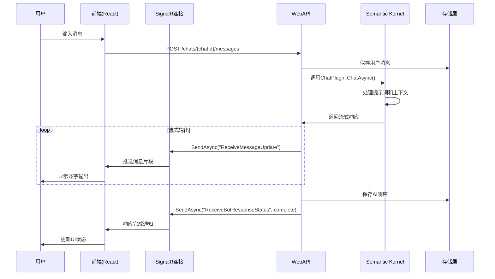
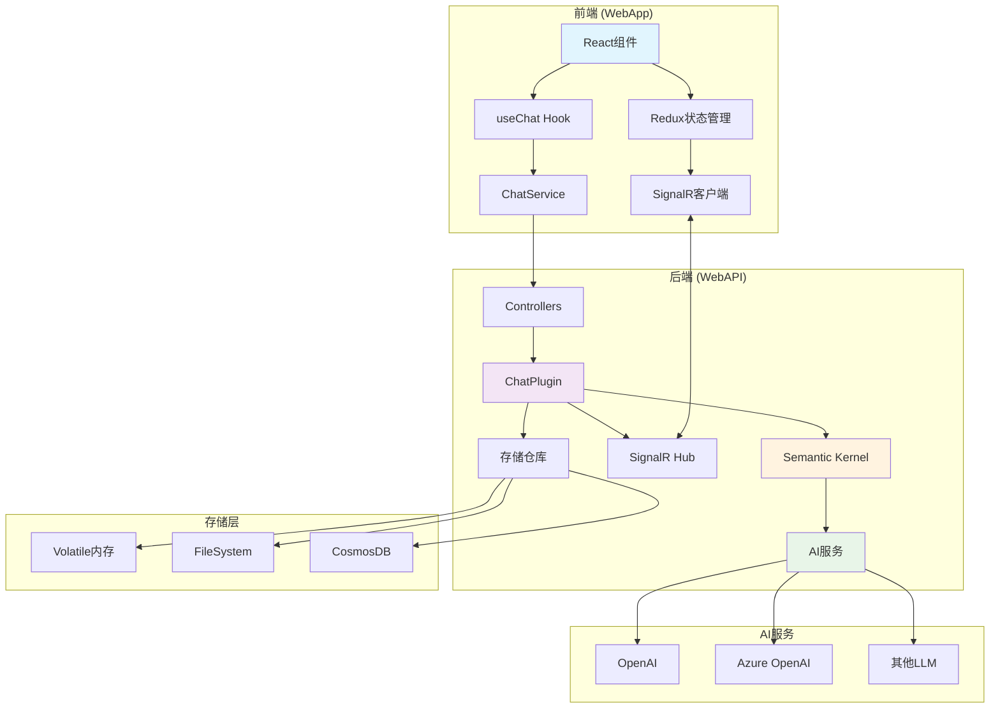

# Chat Copilot 项目架构说明文档

## 项目概述

Chat Copilot 是一个基于 Microsoft Semantic Kernel (SK) 的智能聊天应用，采用前后端分离架构，提供完整的聊天体验，包括实时消息传递、流式输出、插件系统、文档导入等功能。

## 项目结构

```
chat-copilot/
├── webapi/          # 后端Web API服务
├── webapp/          # 前端React应用
├── memorypipeline/  # 内存处理管道
├── plugins/         # 插件系统
└── electron-client/ # 桌面客户端
```

## 一、后端架构 (WebAPI)

### 1.1 核心技术栈

- **框架**: ASP.NET Core 8.0
- **AI内核**: Microsoft Semantic Kernel (SK)
- **实时通信**: SignalR
- **认证**: Azure AD / 无认证模式
- **存储**: 支持 Volatile/FileSystem/CosmosDB
- **内存服务**: Kernel Memory
- **容器化**: Docker支持

### 1.2 主要API接口

#### 聊天相关接口 (`ChatController.cs`)
```csharp
// 核心聊天接口
POST /chats/{chatId}/messages  // 发送消息并获取AI响应
```

#### 存储管理接口
```csharp
// 聊天历史管理
ChatHistoryController.cs       // 聊天历史CRUD
ChatSessionRepository.cs       // 会话管理
ChatMessageRepository.cs       // 消息存储
```

#### 文档管理接口
```csharp
DocumentController.cs          // 文档上传和管理
```

### 1.3 Semantic Kernel集成

#### ChatPlugin 核心功能
- **主入口**: `ChatAsync()` 方法处理所有聊天请求
- **内存管理**: 通过 `KernelMemoryRetriever` 进行语义记忆检索
- **提示渲染**: 动态生成系统指令和用户上下文
- **流式输出**: `StreamResponseToClientAsync()` 实现逐字输出
- **令牌管理**: 智能令牌预算分配和使用统计

#### SK功能集成程度
```csharp
// 已集成的SK功能：
✅ 聊天完成 (ChatCompletion)
✅ 内存服务 (Kernel Memory)  
✅ 插件系统 (Plugins)
✅ 提示模板 (Prompts)
✅ 计划器 (Planners)
✅ 语义检索 (Semantic Search)

// 可进一步集成：
🔄 更多内置插件
🔄 高级计划器功能
🔄 多模态支持
```

### 1.4 配置系统

#### 关键配置项 (`appsettings.json`)
```json
{
  "Service": {
    "TimeoutLimitInS": "120",           // API超时设置
    "SemanticPluginsDirectory": "./Plugins/SemanticPlugins",
    "NativePluginsDirectory": "./Plugins/NativePlugins"
  },
  "Authentication": {
    "Type": "None|AzureAd"              // 认证模式
  },
  "ChatStore": {
    "Type": "volatile|filesystem|cosmos", // 存储类型
    "Filesystem": {
      "FilePath": "./data/chatstore.json"
    }
  },
  "Prompts": {
    "CompletionTokenLimit": 4096,       // 模型令牌限制
    "ResponseTokenLimit": 1024,         // 响应令牌限制
    "SystemDescription": "...",         // 系统描述
    "InitialBotMessage": "..."          // 初始欢迎消息
  }
}
```

### 1.5 插件系统架构

#### 插件类型
1. **内置插件** (`Plugins/Chat/`)
   - ChatPlugin: 核心聊天功能
   - KernelMemoryRetriever: 记忆检索

2. **OpenAPI插件** (`Plugins/OpenApi/`)
   - GitHub插件
   - Jira插件
   - 支持自定义插件扩展

3. **托管插件**
   - 通过配置动态加载
   - 支持运行时启用/禁用

## 二、前端架构 (WebApp)

### 2.1 核心技术栈

- **框架**: React 18 + TypeScript
- **状态管理**: Redux Toolkit
- **UI库**: Fluent UI React Components
- **实时通信**: @microsoft/signalr
- **认证**: @azure/msal-react
- **构建工具**: Create React App

### 2.2 组件架构

#### 主要组件层次
```
App.tsx
└── ChatView.tsx
    ├── ChatList.tsx              // 聊天列表
    └── ChatWindow.tsx            // 聊天窗口
        ├── ChatRoom.tsx          // 聊天室
        │   ├── ChatHistory.tsx   // 消息历史
        │   └── ChatInput.tsx     // 输入框
        └── 其他标签页组件
```

#### 关键Hook
```typescript
// useChat.ts - 核心聊天逻辑
interface GetResponseOptions {
  messageType: ChatMessageType;
  value: string;
  chatId: string;
  kernelArguments?: IAskVariables[];
  processPlan?: boolean;
}

const useChat = () => {
  // 创建聊天、发送消息、加载历史等
  const createChat = async () => {...}
  const getResponse = async (options: GetResponseOptions) => {...}
  const loadChats = async () => {...}
}
```

### 2.3 Redux状态管理

#### 状态结构
```typescript
interface RootState {
  app: AppState;                    // 应用全局状态
  conversations: ConversationsState; // 聊天会话状态
  plugins: PluginsState;            // 插件状态
  users: UsersState;                // 用户状态
}

interface ConversationsState {
  conversations: Conversations;      // 所有聊天会话
  selectedId: string;               // 当前选中的聊天ID
}

interface ChatState {
  id: string;
  title: string;
  messages: IChatMessage[];         // 消息列表
  users: IChatUser[];              // 参与用户
  botResponseStatus?: string;       // Bot响应状态
  enabledHostedPlugins: string[];   // 启用的插件
}
```

## 三、前后端交互机制

### 3.1 HTTP API通信

#### 标准REST调用
```typescript
// ChatService.ts
class ChatService extends BaseService {
  // 发送消息获取响应
  public async getBotResponseAsync(
    ask: IAsk,
    accessToken: string,
    enabledPlugins?: Plugin[],
    processPlan?: boolean
  ): Promise<IAskResult> {
    // POST /chats/{chatId}/messages
  }
  
  // 获取聊天历史
  public async getChatMessagesAsync(
    chatId: string,
    startIdx: number,
    count: number,
    accessToken: string
  ): Promise<IChatMessage[]> {
    // GET /chats/{chatId}/messages
  }
}
```

### 3.2 SignalR实时通信

#### 后端Hub (`MessageRelayHub.cs`)
```csharp
public class MessageRelayHub : Hub
{
  // 将客户端加入聊天组
  public async Task AddClientToGroupAsync(string chatId);
  
  // 发送消息到其他客户端
  public async Task SendMessageAsync(string chatId, string senderId, object message);
  
  // 发送用户输入状态
  public async Task SendUserTypingStateAsync(string chatId, string userId, bool isTyping);
}
```

#### 前端SignalR连接 (`signalRHubConnection.ts`)
```typescript
// SignalR回调方法
enum SignalRCallbackMethods {
  ReceiveMessage = 'ReceiveMessage',           // 接收新消息
  ReceiveMessageUpdate = 'ReceiveMessageUpdate', // 接收消息更新(流式)
  ReceiveBotResponseStatus = 'ReceiveBotResponseStatus', // 接收Bot状态
  ReceiveUserTypingState = 'ReceiveUserTypingState'      // 接收输入状态
}

// 连接配置
const hubConnection = new signalR.HubConnectionBuilder()
  .withUrl('/messageRelayHub')
  .withAutomaticReconnect()     // 自动重连
  .withHubProtocol(new signalR.JsonHubProtocol())
  .build();
```

## 四、聊天记录存储与持久化

### 4.1 存储架构

#### 三种存储模式
```csharp
// 1. Volatile存储 - 内存临时存储
"ChatStore": { "Type": "volatile" }

// 2. FileSystem存储 - 本地文件持久化
"ChatStore": { 
  "Type": "filesystem",
  "Filesystem": { "FilePath": "./data/chatstore.json" }
}

// 3. CosmosDB存储 - 云端数据库
"ChatStore": { 
  "Type": "cosmos",
  "Cosmos": {
    "Database": "CopilotChat",
    "ChatSessionsContainer": "chatsessions",
    "ChatMessagesContainer": "chatmessages"
  }
}
```

#### 存储实体模型
```csharp
// 聊天会话
public class ChatSession
{
  public string Id { get; set; }
  public string Title { get; set; }
  public string SystemDescription { get; set; }
  public DateTimeOffset CreatedOn { get; set; }
  public HashSet<string> EnabledPlugins { get; set; }
}

// 聊天消息
public class CopilotChatMessage
{
  public string Id { get; set; }
  public string ChatId { get; set; }
  public string UserId { get; set; }
  public string Content { get; set; }
  public ChatMessageType Type { get; set; }
  public AuthorRoles AuthorRole { get; set; }
  public DateTimeOffset Timestamp { get; set; }
}
```

### 4.2 前端持久化

#### localStorage缓存机制
- 聊天历史本地缓存(7天保留期)
- 防抖写入机制(2秒延迟)
- 多会话数据隔离
- 页面刷新后自动恢复

## 五、流式输出实现机制

### 5.1 后端流式处理

#### 核心流程 (`ChatPlugin.cs`)
```csharp
// 流式响应处理 - 实际实现
private async Task<CopilotChatMessage> StreamResponseToClientAsync(
    string chatId,
    string userId,
    BotResponsePrompt prompt,
    CancellationToken cancellationToken,
    IEnumerable<CitationSource>? citations = null)
{
    // 1. 获取聊天完成服务
    var chatCompletion = this._kernel.GetRequiredService<IChatCompletionService>();
    
    // 2. 创建流式请求
    var stream = chatCompletion.GetStreamingChatMessageContentsAsync(
        prompt.MetaPromptTemplate,
        this.CreateChatRequestSettings(),
        this._kernel,
        cancellationToken);

    // 3. 创建初始空消息
    var chatMessage = await this.CreateBotMessageOnClient(
        chatId, userId, JsonSerializer.Serialize(prompt), 
        string.Empty, cancellationToken, citations);

    // 4. 流式累积并更新内容
    await foreach (var contentPiece in stream)
    {
        chatMessage.Content += contentPiece;  // 累积内容
        // 每收到一个内容片段就立即发送更新
        await this.UpdateMessageOnClient(chatMessage, cancellationToken);
    }

    return chatMessage;
}

// 创建初始消息
private async Task<CopilotChatMessage> CreateBotMessageOnClient(...)
{
    var chatMessage = CopilotChatMessage.CreateBotResponseMessage(chatId, content, prompt, citations, tokenUsage);
    // 发送ReceiveMessage事件创建新消息
    await this._messageRelayHubContext.Clients.Group(chatId)
        .SendAsync("ReceiveMessage", chatId, userId, chatMessage, cancellationToken);
    return chatMessage;
}

// 更新消息内容
private async Task UpdateMessageOnClient(CopilotChatMessage message, CancellationToken cancellationToken)
{
    // 发送ReceiveMessageUpdate事件更新消息内容
    await this._messageRelayHubContext.Clients.Group(message.ChatId)
        .SendAsync("ReceiveMessageUpdate", message, cancellationToken);
}
```

#### SignalR广播机制
```csharp
// 更新消息到客户端
private async Task UpdateMessageOnClient(CopilotChatMessage message, CancellationToken cancellationToken)
{
    await _messageRelayHubContext.Clients.Group(message.ChatId)
        .SendAsync("ReceiveMessageUpdate", message, cancellationToken);
}
```

### 5.2 前端流式接收

#### SignalR事件处理
```typescript
// 接收消息更新(流式输出)
hubConnection.on(SignalRCallbackMethods.ReceiveMessageUpdate, (message: IChatMessage) => {
    const { chatId, id: messageId, content } = message;
    
    // 如果tokenUsage已定义，说明流式输出完成，更新token使用量
    // 否则更新消息内容
    store.dispatch({
        type: 'conversations/updateMessageProperty',
        payload: {
            chatId,
            messageIdOrIndex: messageId,
            property: message.tokenUsage ? 'tokenUsage' : 'content',
            value: message.tokenUsage ?? content,
            frontLoad: true,
        },
    });
});
```

#### 流式显示效果
- **逐字显示**: 每次收到内容更新立即渲染
- **智能回退**: 60秒超时后自动回退到传统API
- **状态指示**: 显示"AI正在思考中..."等状态

## 六、新聊天界面开发指南

### 6.1 参考现有架构

基于现有的聊天流程，您可以按以下方式开发新的聊天界面：

#### 1. 复用后端ChatPlugin
```csharp
// 后端无需修改，直接调用现有的聊天API
POST /chats/{chatId}/messages
```

#### 2. 创建新的前端组件
```typescript
// 参考现有组件结构
const NewChatInterface: React.FC = () => {
  const chat = useChat();  // 复用现有Hook
  
  const handleSendMessage = async (message: string) => {
    await chat.getResponse({
      messageType: ChatMessageType.Message,
      value: message,
      chatId: selectedChatId
    });
  };
  
  // 自定义UI实现
  return <YourCustomChatUI />;
};
```

#### 3. 集成SignalR
```typescript
// 复用现有SignalR连接
import { getOrCreateHubConnection } from '../redux/features/message-relay/signalRHubConnection';

// 监听相同的事件
hubConnection.on('ReceiveMessage', handleReceiveMessage);
hubConnection.on('ReceiveMessageUpdate', handleMessageUpdate);
```

### 6.2 扩展建议

1. **医疗AI助手**: 如现有记忆中的医生聊天界面
2. **专业领域聊天**: 基于不同的系统描述和插件配置
3. **多模态界面**: 支持图像、语音等输入
4. **自定义UI样式**: 保持相同的数据流，自定义展示方式

## 七、关键技术要点

### 7.1 性能优化
- **令牌管理**: 智能截取聊天历史，避免超出模型限制
- **分页加载**: 聊天历史分页获取
- **连接池**: HTTP客户端工厂模式
- **缓存机制**: 前端状态缓存和本地存储

### 7.2 错误处理
- **超时处理**: API调用超时和取消机制
- **重连机制**: SignalR自动重连
- **降级策略**: 流式输出失败时回退到同步模式
- **用户反馈**: 详细的错误信息展示

### 7.3 安全考虑
- **认证授权**: 支持Azure AD和匿名模式
- **内容安全**: Azure Content Safety集成
- **参数验证**: 前后端参数校验
- **CORS配置**: 跨域请求安全配置

## 八、部署与运维

### 8.1 容器化部署
```yaml
# docker-compose.yaml
services:
  webapi:
    build: ./webapi
    ports:
      - "40443:80"
    environment:
      - ASPNETCORE_ENVIRONMENT=Production
      
  webapp:
    build: ./webapp  
    ports:
      - "8440:80"
    depends_on:
      - webapi
```

### 8.2 配置管理
- **开发环境**: appsettings.Development.json
- **生产环境**: 环境变量 + Azure Key Vault
- **用户密钥**: dotnet user-secrets 管理敏感信息

### 8.3 监控与日志
- **Application Insights**: 遥测数据收集
- **自定义事件**: 插件调用追踪
- **健康检查**: /healthz 端点
- **性能监控**: Token使用量统计

## 九、完整交互流程图

### 9.1 聊天消息流程


### 9.2 系统架构总览


## 十、技术细节补充

### 10.1 SignalR连接管理
```typescript
// 连接配置和重连策略
const hubConnection = new signalR.HubConnectionBuilder()
    .withUrl('/messageRelayHub', {
        skipNegotiation: true,
        transport: signalR.HttpTransportType.WebSockets,
        logger: signalR.LogLevel.Warning,
    })
    .withAutomaticReconnect()  // 自动重连：2秒、4秒、8秒间隔
    .withHubProtocol(new signalR.JsonHubProtocol())
    .build();

// 连接超时设置
hubConnection.serverTimeoutInMilliseconds = 60000;
```

### 10.2 令牌预算管理
```csharp
// 智能令牌预算计算
private int GetMaxRequestTokenBudget()
{
    const int ExtraOpenAiMessageTokens = 20;  // OpenAI系统消息开销
    return this._promptOptions.CompletionTokenLimit    // 模型总限制
           - ExtraOpenAiMessageTokens                  // 系统开销
           - this._promptOptions.ResponseTokenLimit    // 响应预留
           - this._promptOptions.FunctionCallingTokenLimit; // 函数调用预留
}
```

### 10.3 错误处理策略
```csharp
// 超时和取消处理
try
{
    using CancellationTokenSource? cts = this._serviceOptions.TimeoutLimitInS is not null
        ? new CancellationTokenSource(TimeSpan.FromSeconds((double)this._serviceOptions.TimeoutLimitInS))
        : null;

    result = await kernel.InvokeAsync(chatFunction!, contextVariables, cts?.Token ?? default);
}
catch (Exception ex)
{
    if (ex is OperationCanceledException || ex.InnerException is OperationCanceledException)
    {
        return this.StatusCode(StatusCodes.Status504GatewayTimeout, $"The chat {ChatFunctionName} timed out.");
    }
    throw;
}
```

## 十一、性能优化要点

### 11.1 前端优化
- **虚拟滚动**: 长聊天历史的性能优化
- **防抖输入**: 减少不必要的API调用
- **状态缓存**: Redux状态持久化
- **代码分割**: 按需加载组件

### 11.2 后端优化
- **连接池**: HTTP客户端工厂管理
- **异步处理**: 全面使用async/await
- **内存管理**: 及时释放资源
- **批量操作**: 数据库操作优化

### 11.3 通信优化
- **消息压缩**: SignalR消息压缩
- **连接复用**: 单例连接管理
- **错误重试**: 指数退避重试策略
- **流量控制**: 避免消息洪水攻击

## 十二、安全性考虑

### 12.1 认证和授权
```csharp
// 支持多种认证方式
"Authentication": {
  "Type": "None|AzureAd",
  "AzureAd": {
    "TenantId": "your-tenant-id",
    "ClientId": "your-client-id",
    "Scopes": "access_as_user"
  }
}
```

### 12.2 内容安全
```csharp
// Azure Content Safety集成
"ContentSafety": {
  "Enabled": true,
  "ViolationThreshold": 4,  // 0-6级别
  "Endpoint": "https://your-content-safety.cognitiveservices.azure.com/"
}
```

### 12.3 数据保护
- **敏感数据加密**: 用户密钥管理
- **CORS配置**: 跨域请求控制
- **输入验证**: 前后端参数校验
- **日志脱敏**: 避免敏感信息泄露

## 十三、总结

Chat Copilot 项目展现了现代AI应用的完整架构：

1. **后端**: 强大的SK集成，完善的插件系统，灵活的存储选项
2. **前端**: 现代React架构，实时通信，状态管理完善  
3. **通信**: HTTP REST + SignalR双重通道，支持传统和流式交互
4. **存储**: 多种持久化方案，支持从开发到生产的不同需求
5. **扩展**: 清晰的架构设计，便于开发新的聊天界面和功能

该架构为AI聊天应用提供了一个可靠、可扩展的基础平台，可以根据具体需求进行定制和扩展。通过深入理解这个架构，您可以：

- **快速构建新的聊天界面**: 复用现有的后端API和SignalR连接
- **集成更多AI功能**: 利用SK的强大能力扩展智能特性
- **实现企业级部署**: 使用CosmosDB和Azure服务构建生产环境
- **开发专业化应用**: 如医疗AI助手、教育AI助手等垂直领域应用

这个架构已经在实际项目中得到验证，具有良好的可维护性和扩展性，是学习和开发AI聊天应用的优秀参考。 